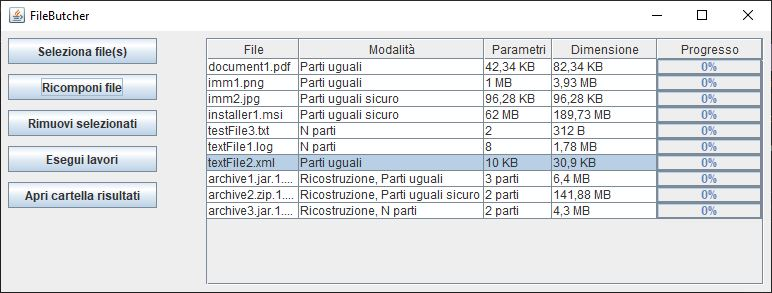

# `FileButcher`

Un semplice applicativo per dividere, cifrare e ricostruire i propri file in Java 8.

Scritto per [l'esame di Programmazione ad Oggetti](http://didattica.agentgroup.unimore.it/wiki/index.php/Programmazione_ad_Oggetti#Modalit.C3.A0_di_Sviluppo_del_Progetto_Java).

## Specifiche

Documento con le specifiche del progetto reperibile al seguente [link](http://didattica.agentgroup.unimore.it/wiki/images/4/48/Tesina1920.pdf).

## Documentazione

La documentazione del progetto è disponibile [qui](https://sicex.github.io/FileButcher), su GitHub Pages.

## Screenshot

